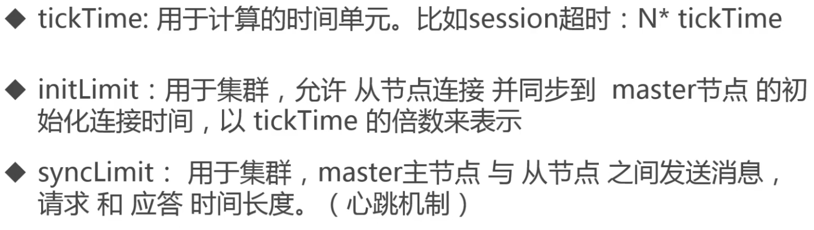

## hbase1.4安装配置
### 使用自带的zookeeper安装配置
### 独立zookeeper安装配置
下载zookeeper
#### zookeeper安装配置
解压zookeeper到指定目录，进入zookeeper目录
1. 配置`zoo.cfg`文件
进入zookeeper目录下的`conf`目录，复制`zoo_sample.cfg`为`zoo.cfg`文件
`cp zoo_sample.cfg zoo.cfg`。
2. `vi`编辑zoo.cfg文件
修改dataDir配置到自己指定位置，在这里我配置成:<br/>
1). dataDir=/home/vagrant/bigdata/zookeeper 必须配置Zookeeper数据存储目录<br/>
3). dataLogDir 配置日志存放目录，如果不配置和dataDir共用一个目录<br/>
4). tickTime=2000为基础时间 ticktime:用于计算的时间单元。比如 session超时:N* ticktime<br/>
5). clientPort=2181为zookeeper的端口号

 

3. 配置zookeeper home
```shell script
export ZOOKEEPER_HOME=/home/vagrant/bigdata/zookeeper-3.5.6
export HADOOP_MAPRED_HOME=/home/vagrant/bigdata/hadoop-3.2.1
export PATH=$PATH:$ZOOKEEPER_HOME/bin
```
> 完成上配置单机版的zookeeper就配置完成了！

##### 启动zookeeper
1. 进入zookeeper的bin目录，执行`./zkServer.sh start`，然后执行`./zkServer.sh status`查看启动状态。
2. 启动完成后使用`./zkCli.sh`命令行进入zookeeper的交互式命令行。
3. 执行help命令查看zookeeper中支持的所有命令，使用ls /查看根下的节点
##### zookeeper基本数据模型
1. zookeeper是一个树状结构来组织数据的，根是以斜杠开始(`/`)类似与Linux的目录结构。每一个节点可以包含子节点和数据。
2. 每一个节点都称之为 znode,它可以有子节点,也可以有数据
3. 每个节点分为临时节点和永久节点,临时节点在客户端断开后消失
4. 每个zk节点都各自的版本号,可以通过命令行来显示节点信息
5. 每当节点数据发生变化,那么该节点的版本号会累加(乐观锁)
6. 删除/修改过时节点,版本号不匹配则会报错
7. 每个水k节点存储的数据不宜过大,几K即可
8. 节点可以设置权限acl,可以通过权限来限制用户的访问

### phoeninx安装配置