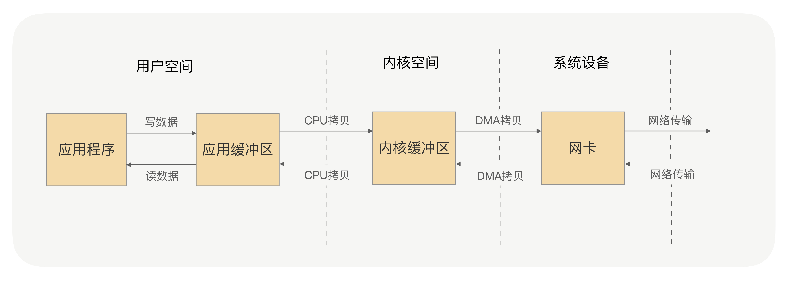

# 包含Netty和RPC的练习例子
## 动态代理
### dynamic-proxy-jdk
JDK自带的动态代理
### dynamic-proxy-javassist
javassist动态代理

## 序列化
### serialize-hessian
hessian序列化
### serialize-protobuf
protobuf序列化需要编写proto文件，使用protobuf带的编译工具生成不同语言的代码。

## Netty
### 数据的两次拷贝

### 零拷贝(Zero-copy)技术
所谓的零拷贝，就是取消用户空间与内核空间之间的数据拷贝操作，应用进程每一次的读写操作，
可以通过一种方式，直接将数据写入内核或从内核中读取数据，
再通过 DMA 将内核中的数据拷贝到网卡，或将网卡中的数据 copy 到内核。

零拷贝有两种解决方式，分别是  mmap+write  方式和  sendfile  方式，其核心原理都是通过虚拟内存来解决的
### Netty的零拷贝
上面讲的零拷贝是操作系统层面上的零拷贝，主要目标是避免用户空间与内核空间之间的数据拷贝操作，可以提升 CPU 的利用率。

Netty 的零拷贝则不大一样，他完全站在了用户空间上，也就是 JVM 上，它的零拷贝主要是偏向于数据操作的优化上。

那么 Netty 是怎么对数据操作进行优化的呢？
* Netty 提供了 CompositeByteBuf 类，它可以将多个 ByteBuf 合并为一个逻辑上的  ByteBuf，避免了各个 ByteBuf 之间的拷贝。
* ByteBuf 支持 slice 操作，因此可以将 ByteBuf 分解为多个共享同一个存储区域的 ByteBuf，避免了内存的拷贝。
* 通过 wrap 操作，我们可以将 byte[] 数组、ByteBuf、ByteBuffer  等包装成一个 Netty ByteBuf 对象, 进而避免拷贝操作。

## RPC
### jdk-rpc
jdk-rpc是不使用任何第三方包的简单rpc。
### laoqian-rpc老钱博客RPC

博客地址：

这个RPC是使用Netty和fastjson实现，这个例子是计算斐波那契数和指数。斐波那契数输入输出比较简单，一个Integer，一个Long。 
指数输入有两个值，输出除了计算结果外还包含计算耗时，以纳秒计算。之所以包含耗时，只是为了呈现一个完整的自定义的输入和输出类。
* 自定义协议类型
* 没有使用代理
* 通过type来确定使用那个处理器处理请求
* 包含消息唯一ID
* 使用JSON序列化

## RPC博客

