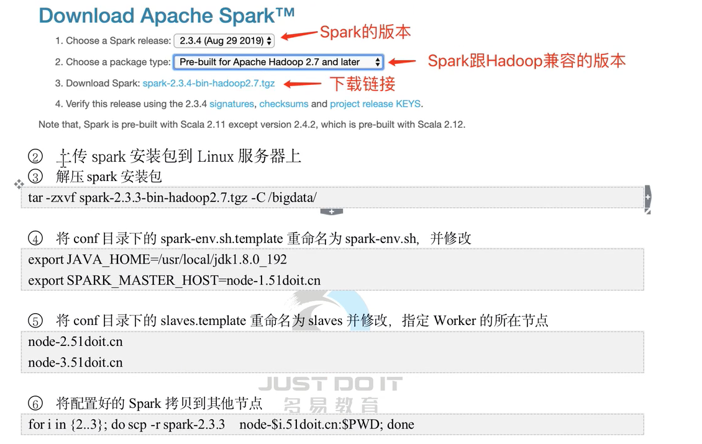
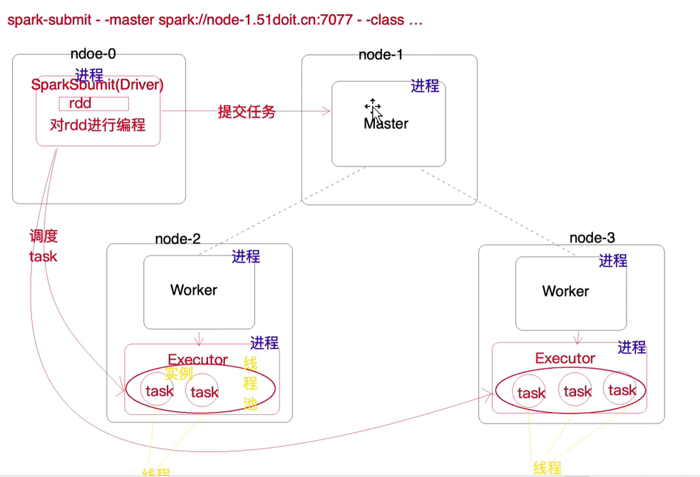
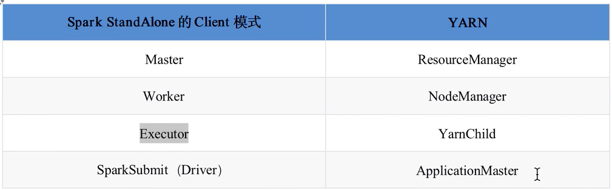

# Spark2.4.5版本

## 1. Spark安装


## 2. 提交任务

```shell script
./spark-submit 
# 指定master节点
--master spark://127.0.0.1:7077 \
# 指定计算内存
--executor-memory 512m \
# 指定计算核数
--total-executor-cores 4 \
# 指定程序的Main方法类和需要提供的参数
--class cn.v5cn.spark.demo.Main /root/WordCount.jar hdfs://127.0.0.1:9000/wc hdfs://127.0.0.1:9000/out2
```
## 3. Spark架构体系


## 4. Spark和Yarn中角色对比
